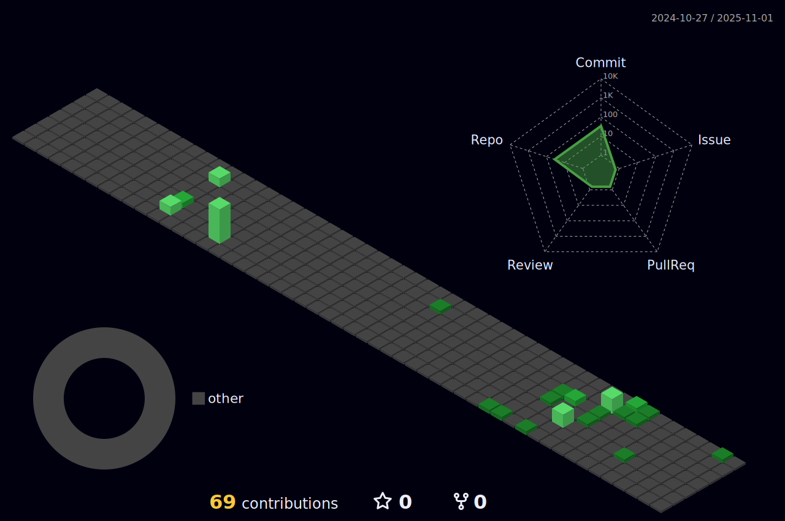

  

###

  

###

<h1 align="center">Hi 👋, I'm The Bear</h1>

<h3 align="center"> Passionate and enthusiastic about technology and cybersecurity in Argentina</h3>

- 🔭 I’m currently working as **Cybersecurity Engineer**

- 🌱 I’m currently learning **IA and IA Security**

- 📝 I regularly write articles on [Cybersecurity]

- 💬 Ask me about **Network, App and Enviroment Security**

- ⚡ Fun fact **Without mate there is no life**
  
<h2 align="center">🌱 My Skills</h2>

<h4 align="center">🛠 Tools I worked with</h4>

<h4 align="center">💻 Programming languages (and html)</h4>

<h4 align="center">📚 Frameworks and Libraries</h4>

<h4 align="center">⚙ Software</h4>

<h4 align="center">☁ Cloud and Providers</h4>

<h2 align="center"> Profile Contrib</h2>

###

<!---
TheBear90/TheBear90 is a ✨ special ✨ repository because its `README.md` (this file) appears on your GitHub profile.
You can click the Preview link to take a look at your changes.
--->
